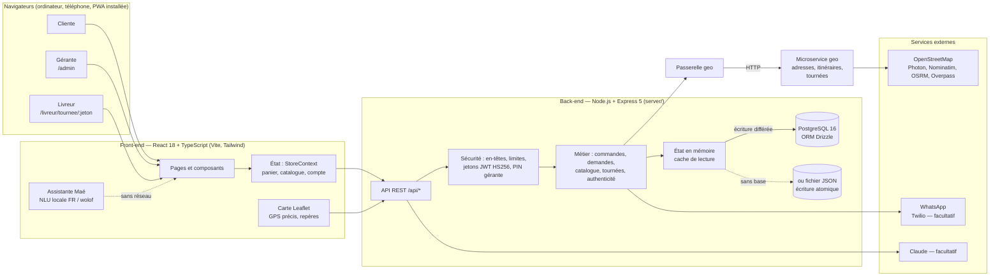
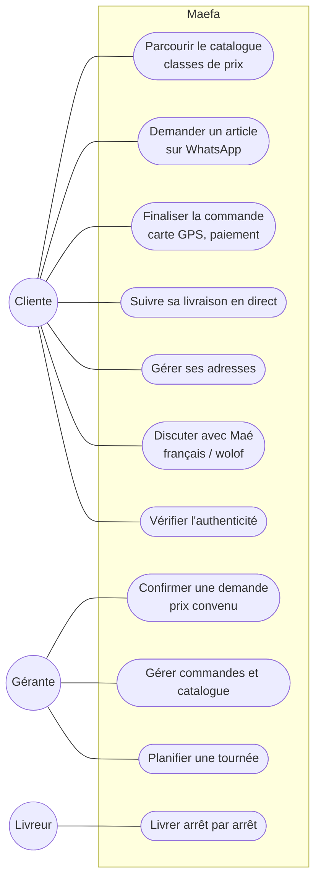
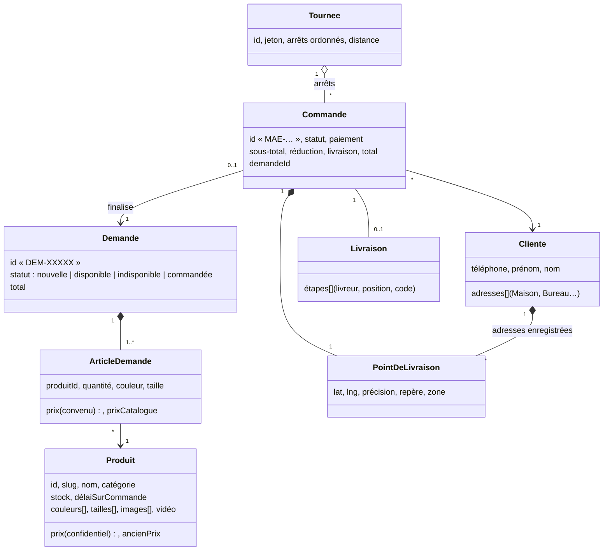
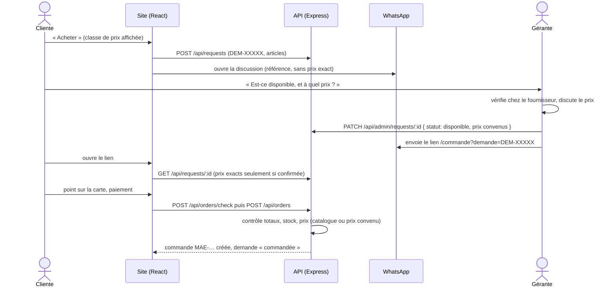
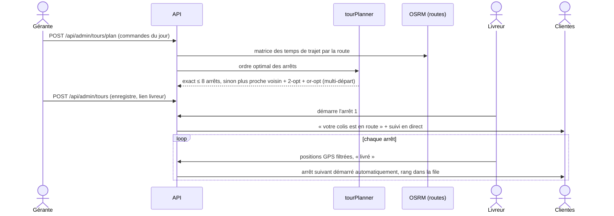
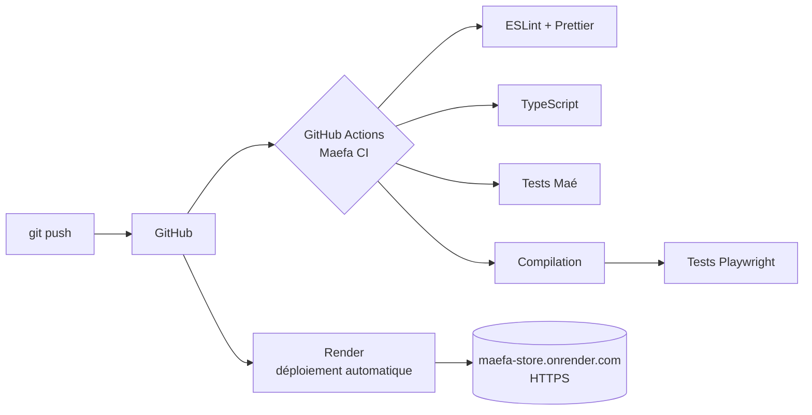

# Maefa Store — dossier technique

Boutique en ligne de chaussures et de sacs (Dakar). Application web progressive (PWA) : la même
application sert la cliente sur ordinateur et sur téléphone, la gérante (espace de gestion) et le
livreur (tournée). Ce dossier décrit l'architecture, les données, les flux principaux, la sécurité,
la stratégie de test et la chaîne d'intégration continue.

Les schémas sont écrits en Mermaid : GitHub les affiche directement ; on peut aussi les copier dans
<https://mermaid.live> pour les exporter en image (pour le mémoire ou les diapositives).

---

## 1. Vue d'ensemble



| Couche | Technologies | Dossier |
|---|---|---|
| Front-end | React 18, TypeScript 5, React Router 7, Tailwind CSS 3, Leaflet, Vite 6 | `src/` |
| Back-end | Node.js 22, Express 5, compression | `server/` |
| Données | PostgreSQL 16 via l'ORM Drizzle (migrations générées), état en mémoire comme cache ; fichier JSON en mode autonome | `server/store.js`, `server/db/`, `docs/MERISE.md` |
| Tests | Playwright (bout en bout), banc d'essai de l'assistante | `tests/e2e/`, `scripts/eval-assistant/` |
| Qualité | TypeScript strict, ESLint, Prettier | `eslint.config.js`, `.prettierrc.json` |
| Livraison | GitHub Actions, Docker, Render | `.github/workflows/maefa-ci.yml`, `Dockerfile` |

### Organisation du code

```
maefa-store/
├─ src/
│  ├─ pages/          écrans (Boutique, Fiche, Panier, Commande, Compte, Admin…, Livreur)
│  ├─ components/     composants réutilisables (carte, carte produit, sélecteur d'adresse…)
│  ├─ context/        StoreContext : panier, catalogue, totaux, synchronisation serveur
│  ├─ assistant/      Maé : classifieur bayésien naïf, extraction d'entités, dialogue
│  ├─ services/api.ts tous les appels HTTP vers le serveur
│  ├─ utils/          GPS précis, formats, prix confidentiels, WhatsApp…
│  └─ config/site.ts  réglages de la boutique (zones, classes de prix, téléphone…)
├─ server/
│  ├─ index.js        démarrage, en-têtes de sécurité, contrôle des totaux
│  ├─ orders.js       commandes, suivi, livreurs, géolocalisation
│  ├─ requests.js     demandes WhatsApp (DEM-XXXXX), prix convenus
│  ├─ catalog.js      catalogue partagé, stock, « sur commande »
│  ├─ tourPlanner.js  optimisation des tournées de livraison
│  ├─ geoGateway.js   passerelle vers le microservice geo (ou calcul intégré)
│  ├─ jwt.js          jetons JWT HS256
│  ├─ db/             schéma PostgreSQL (Drizzle), migrations, dépôt
│  ├─ geo.js          adresses, itinéraires, lieux connus (OpenStreetMap)
│  ├─ auth.js         comptes clientes (code SMS, sessions JWT révocables)
│  ├─ adminAuth.js    accès gérante (PIN vérifié côté serveur)
│  └─ store.js        persistance
├─ services/geo/     microservice de géolocalisation et de tournées
├─ tests/e2e/         18 scénarios Playwright + lanceur
├─ tests/unit/        tests unitaires et d'intégration (node:test)
└─ docs/              ce dossier, schéma de base de données, API (OpenAPI)
```

### Patrons de conception

| Patron | Où | Rôle |
|---|---|---|
| **MVC** | Vues : composants React (`src/pages`, `src/components`) ; contrôleurs : routes Express (`server/*.js`, `register…Routes`) ; modèle : `server/store.js` + `server/db/` | séparer l'affichage, le traitement des requêtes et les données |
| **Injection de dépendances** | `server/index.js` (racine de composition) crée `store`, `wa`, `geo`, `isAdmin`, `limit` et les passe à chaque `register…Routes(app, { … })` | chaque module reçoit ce dont il a besoin ; on peut le tester avec des doublures |
| **Dépôt (Repository)** | `server/db/pgRepository.js` (PostgreSQL) ou fichier JSON derrière la même interface (`store.js`) | changer de stockage sans toucher aux routes |
| **Passerelle (Gateway) + Stratégie** | `server/geoGateway.js` : implémentation intégrée ou client HTTP du microservice, choisie à la configuration | découpler le métier du service de géolocalisation, avec repli automatique |
| **Contexte (Provider)** | `StoreContext`, `AccountContext` (React) | état partagé du panier, du catalogue et du compte |

### Microservice « geo »

`services/geo/server.js` est un service HTTP **indépendant et sans état** : recherche d'adresse,
adresse d'un point, lieux connus, itinéraire, matrice des temps de trajet et **optimisation des
tournées**. Le serveur principal l'appelle quand `GEO_SERVICE_URL` est défini ; s'il ne répond pas,
la passerelle calcule localement (le site ne tombe jamais en panne à cause de lui). Avec Docker,
`docker compose up` lance trois conteneurs : `api`, `geo` et `db` (PostgreSQL).

---

## 2. Acteurs et cas d'utilisation



---

## 3. Modèle de données

Le serveur travaille sur un **état en mémoire** (lectures instantanées, même pendant un pic) et
l'enregistre de deux façons, au choix :

- **PostgreSQL** (variable `DATABASE_URL`) : 15 tables relationnelles décrites avec l'**ORM Drizzle**
  (`server/db/schema.js`), créées par une **migration** générée (`server/db/migrations/`). Clés
  primaires et étrangères (suppression en cascade), contraintes CHECK (prix positif, statut valide,
  coordonnées GPS), index. Le dépôt `server/db/pgRepository.js` recharge l'état au démarrage et
  n'écrit que les lignes modifiées, dans une transaction, au plus toutes les 300 ms. Au premier
  démarrage sur une base vide, les données du fichier JSON y sont copiées.
- **Fichier JSON** (mode autonome, sans base) : écriture dans un fichier temporaire puis renommage
  (atomique), écriture forcée à l'arrêt du serveur.

La démarche MERISE complète (règles de gestion, dictionnaire, MCD, MLD) est dans
[`MERISE.md`](MERISE.md) ; un équivalent MySQL (21 tables, diagramme EER) dans
`docs/base-de-donnees/`.



---

## 4. Flux principaux

### 4.1 Achat : demande WhatsApp, prix convenu, commande

La boutique est revendeuse : la disponibilité est vérifiée chez le fournisseur avant toute
commande, et le prix exact (éventuellement discuté) n'est donné qu'à ce moment-là.



### 4.2 Tournée de livraison



---

## 5. Algorithmes notables

| Problème | Solution | Fichier |
|---|---|---|
| Ordre des livraisons (voyageur de commerce) | Recherche exacte jusqu'à 8 arrêts ; au-delà, plus proche voisin depuis plusieurs départs, puis améliorations 2-opt et or-opt, sur les vrais temps de trajet routiers | `server/tourPlanner.js` |
| Position GPS imprécise | Écoute prolongée, rejet des mesures aberrantes, moyenne pondérée par 1/précision² | `src/utils/preciseGps.ts` |
| Trace du livreur qui « saute » | Filtre de vitesse plausible et lissage pondéré | `src/utils/preciseGps.ts` |
| Comprendre la cliente (français / wolof) | Classifieur bayésien naïf entraîné sur des phrases d'exemple, extraction d'entités (type, couleur, budget, pointure, quartier), mémoire de dialogue | `src/assistant/` |
| Repères pour le livreur | Lieux connus autour du point (mosquées, pharmacies, écoles, arrêts) via Overpass, triés par distance | `server/geo.js` |

---

## 6. Sécurité

- **Contrôle côté serveur** de tout ce qui vient du navigateur : totaux, réductions, frais de
  livraison (jamais nuls), prix (catalogue ou prix convenu par la gérante), stock.
- **Prix confidentiels** : le public ne reçoit qu'une classe de prix (pages, aperçus de liens,
  données de référencement, IA) ; le prix exact n'apparaît qu'avec le lien de la gérante.
- **Accès gérante** : code PIN vérifié uniquement par le serveur, jeton **JWT** (RFC 7519, HS256, 12 h) dont la clé dépend du PIN : changer le PIN déconnecte tout le monde.
- **Comptes clientes** : connexion par code SMS ou code personnel (haché scrypt), **JWT** dont l'identifiant renvoie à une session serveur (donc révocable : déconnexion, suppression du compte), sel et secret hors du code
  (`AUTH_SECRET` en variable d'environnement).
- **Limites de débit** par adresse IP et par téléphone (adaptées au partage d'IP des opérateurs
  mobiles).
- **En-têtes** : Content-Security-Policy stricte, `X-Frame-Options`, `nosniff`,
  `Referrer-Policy`, `Permissions-Policy`.
- **Authenticité** : marques secrètes jamais stockées dans le dépôt.

---

## 7. Qualité et tests

| Niveau | Outil | Contenu |
|---|---|---|
| Tests unitaires | `npm run test:unit` (testeur intégré de Node.js) | JWT, optimisation des tournées (comparée à la recherche exhaustive), classes de prix, contrôle des prix convenus |
| Analyse statique | TypeScript strict, ESLint, Prettier | erreurs de types, règles React (hooks), mise en forme |
| Tests de l'assistante | `npm run test:assistant` | 66 vérifications : intentions, entités, langue, honnêteté commerciale |
| Tests de bout en bout | `npm run test:e2e` (Playwright) | 17 scénarios, 292 vérifications, sur téléphones et ordinateurs simulés |
| Charge | test ponctuel | 200 commandes simultanées sans erreur |

Les scénarios de bout en bout lancent un serveur neuf par scénario et simulent les services de
carte (`tests/e2e/geomock.cjs`) : ils ne dépendent d'aucun service extérieur.

| Scénario | Ce qui est vérifié |
|---|---|
| `livraison` | GPS précis, carte plein écran, zones, suivi du livreur en direct |
| `adresse` | lieux connus proposés, repère en un toucher, adresses enregistrées |
| `demande` | achat via WhatsApp, réponse de la gérante, lien de finalisation |
| `marchandage` | prix convenu, total recalculé, commande au prix convenu, prix inventé refusé |
| `prixconf` | aucune fuite du prix exact (pages, panier, aperçus de liens, API) |
| `tour` | tournée optimisée, notifications, suivi par la cliente |
| `audit` | stock, annulation, réalignement des prix |
| `expert` | catalogue partagé, « sur commande », Le Marché |
| `compte` | connexion par code, profil, commandes |
| autres | espace cliente, statut WhatsApp, authenticité, assistante, wolof |

---

## 8. Intégration et déploiement continus



- **Docker** : `docker compose up --build` lance le site complet (image en deux étapes :
  compilation, puis image d'exécution minimale ; données dans un volume).
- **Render** : déploiement automatique à chaque envoi sur la branche.
- **WAMP** : paquet hors ligne (`maefa-wamp.zip`) pour une démonstration sans Internet.

---

## 9. Démarche et rôle de l'intelligence artificielle

Le projet a été mené de façon itérative : chaque besoin exprimé par la gérante (exemples :
« les clientes ne savent pas lire une carte », « on aime marchander », « pas de livraison
gratuite ») devient une fonctionnalité, testée automatiquement puis mise en ligne.

L'écriture du code a été assistée par un modèle d'IA (Claude). La conception fonctionnelle,
les règles métier, les arbitrages (refus des copies de grandes marques, prix confidentiels,
vente via WhatsApp), la validation des résultats et les tests en conditions réelles relèvent de
la cheffe de projet. L'historique Git (messages de commit) garde la trace de chaque étape.

---

## 10. Limites et perspectives

- Héberger la base PostgreSQL en production (Render Postgres, Neon ou Supabase) : il suffit de définir `DATABASE_URL`.
- Publier l'application sur le **Play Store** (enveloppe Android de la PWA).
- Paiement en ligne intégré (Wave Business, Orange Money API).
- Ouvrir la plateforme à d'autres commerçantes.
