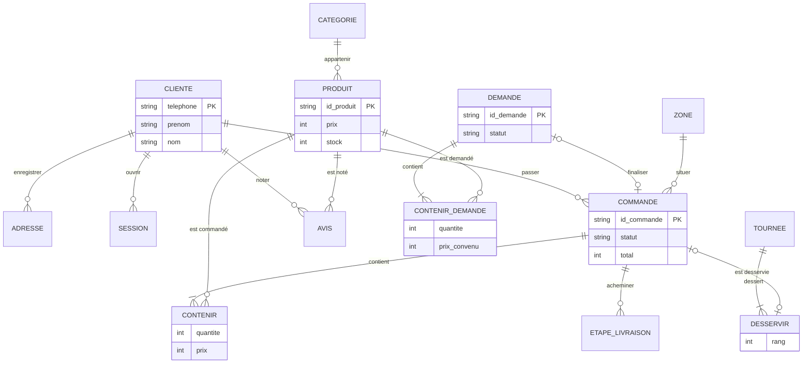

# Modélisation MERISE — Maefa Store

Démarche : règles de gestion → dictionnaire des données → **MCD** (modèle conceptuel) →
**MLD** (modèle logique relationnel) → **MPD** (schéma physique PostgreSQL, `server/db/schema.sql`,
et MySQL, `docs/base-de-donnees/maefa-mysql.sql`).

---

## 1. Règles de gestion

| N° | Règle |
|---|---|
| RG1 | Une cliente est identifiée par son numéro de téléphone (format international). |
| RG2 | Une cliente peut enregistrer plusieurs adresses de livraison ; une adresse appartient à une seule cliente. |
| RG3 | Un produit appartient à une seule catégorie ; une catégorie regroupe plusieurs produits. |
| RG4 | Une demande d'achat porte une référence unique DEM-XXXXX et contient au moins un produit. |
| RG5 | Pour chaque produit d'une demande, la gérante peut fixer un prix convenu différent du prix catalogue. |
| RG6 | Une commande ne peut être finalisée qu'à partir d'une demande confirmée « disponible » ; une demande donne au plus une commande. |
| RG7 | Une commande contient au moins un produit, avec sa quantité, sa couleur, sa taille et son prix. |
| RG8 | Une commande est livrée en un point (coordonnées GPS, repère) situé dans une zone de livraison ; les frais dépendent de la zone et ne sont jamais nuls. |
| RG9 | Une commande peut être livrée en une ou plusieurs étapes (relais), chacune confiée à un livreur. |
| RG10 | Une tournée dessert plusieurs commandes dans un ordre calculé ; une commande appartient au plus à une tournée à la fois. |
| RG11 | Une cliente peut laisser un avis par produit acheté. |
| RG12 | Une session de connexion appartient à une cliente ; seule l'empreinte du jeton est gardée. |

## 2. Dictionnaire des données (extrait)

| Code | Signification | Type | Taille | Entité |
|---|---|---|---|---|
| telephone | Numéro de la cliente (+221…) | AN | 20 | CLIENTE |
| prenom, nom | Identité | A | 60 | CLIENTE |
| empreinte_code | Code personnel chiffré (scrypt) | AN | 128 | CLIENTE |
| id_adresse | Identifiant d'adresse | AN | 40 | ADRESSE |
| libelle_adresse | « Maison », « Bureau »… | A | 40 | ADRESSE |
| latitude, longitude | Coordonnées GPS | N | 9,6 | ADRESSE, COMMANDE |
| repere | « À côté de la mosquée… » | AN | 160 | ADRESSE, COMMANDE |
| id_produit | Référence produit (MAE-101) | AN | 40 | PRODUIT |
| prix | Prix de vente en FCFA (confidentiel) | N | 10 | PRODUIT |
| stock | Quantité disponible | N | 5 | PRODUIT |
| delai_sur_commande | Délai en jours si épuisé | N | 3 | PRODUIT |
| id_demande | Référence DEM-XXXXX | AN | 9 | DEMANDE |
| statut_demande | nouvelle, disponible, indisponible, commandée | A | 15 | DEMANDE |
| prix_convenu | Prix fixé après marchandage | N | 10 | CONTENIR_DEMANDE |
| id_commande | Référence MAE-… | AN | 20 | COMMANDE |
| statut_commande | en attente, confirmée, en préparation, expédiée, livrée, annulée | A | 15 | COMMANDE |
| mode_paiement | wave, orange_money, cash | A | 15 | COMMANDE |
| total | Montant total en FCFA | N | 10 | COMMANDE |
| nom_zone, frais_zone | Zone de livraison et frais | A / N | 60 / 6 | ZONE |
| id_tournee, rang | Tournée et ordre de passage | AN / N | 20 / 3 | TOURNEE, DESSERVIR |

## 3. MCD — Modèle conceptuel des données

### Entités
- **CLIENTE** (<u>telephone</u>, prenom, nom, empreinte_code, date_creation)
- **ADRESSE** (<u>id_adresse</u>, libelle, icone, latitude, longitude, repere, precision)
- **CATEGORIE** (<u>id_categorie</u>, nom)
- **PRODUIT** (<u>id_produit</u>, nom, slug, prix, ancien_prix, stock, delai_sur_commande, description)
- **DEMANDE** (<u>id_demande</u>, statut, date, note, total)
- **COMMANDE** (<u>id_commande</u>, statut, mode_paiement, statut_paiement, sous_total, reduction, frais_livraison, total, latitude, longitude, repere, date)
- **ZONE** (<u>nom_zone</u>, frais, delai)
- **ETAPE_LIVRAISON** (<u>id_etape</u>, nom_livreur, telephone_livreur, statut, position)
- **TOURNEE** (<u>id_tournee</u>, jeton, date, distance)
- **AVIS** (<u>id_avis</u>, note, commentaire, date)
- **SESSION** (<u>empreinte_jeton</u>, date)

### Associations et cardinalités

| Association | Entité A (card.) | Entité B (card.) | Propriétés |
|---|---|---|---|
| ENREGISTRER | CLIENTE (0,n) | ADRESSE (1,1) | — |
| APPARTENIR | PRODUIT (1,1) | CATEGORIE (0,n) | — |
| CONTENIR_DEMANDE | DEMANDE (1,n) | PRODUIT (0,n) | quantite, couleur, taille, prix_convenu, prix_catalogue |
| FINALISER | COMMANDE (0,1) | DEMANDE (0,1) | — |
| PASSER | CLIENTE (0,n) | COMMANDE (1,1) | — |
| CONTENIR | COMMANDE (1,n) | PRODUIT (0,n) | quantite, couleur, taille, prix |
| SITUER | COMMANDE (1,1) | ZONE (0,n) | — |
| ACHEMINER | COMMANDE (0,n) | ETAPE_LIVRAISON (1,1) | ordre |
| DESSERVIR | TOURNEE (1,n) | COMMANDE (0,1) | rang |
| NOTER | CLIENTE (0,n) / PRODUIT (0,n) | AVIS (1,1) | — |
| OUVRIR | CLIENTE (0,n) | SESSION (1,1) | — |

### Schéma

## 4. MLD — Modèle logique relationnel

Règles de passage : une entité devient une table ; une association (1,1)–(0,n) devient une clé
étrangère du côté (1,1) ; une association (x,n)–(x,n) devient une table dont la clé est le couple
des clés ; ses propriétés deviennent des colonnes.

- **customers** (<u>phone</u>, first_name, last_name, pin_hash, wishlist, created_at, updated_at)
- **customer_addresses** (<u>id</u>, #customer_phone, name, icon, lat, lng, label, landmark, accuracy)
- **sessions** (<u>token_hash</u>, #customer_phone, created_at)
- **products** (<u>id</u>, slug, name, category, price, old_price, stock, preorder_days, data)
- **purchase_requests** (<u>id</u>, status, created_at, total, note, #order_id, customer, history)
- **request_items** (<u>id</u>, #request_id, product_id, name, price, catalog_price, quantity, size, color)
- **orders** (<u>id</u>, status, payment_method, payment_status, subtotal, discount, delivery_fee, gift_fee, total, zone, #request_id, customer_phone, created_at, data)
- **order_items** (<u>id</u>, #order_id, product_id, name, price, quantity, size, color)
- **deliveries** (<u>#order_id</u>, data)
- **tours** (<u>id</u>, token, created_at, data)
- **account_orders** (<u>#customer_phone, order_id</u>, data)

`#` = clé étrangère ; <u>souligné</u> = clé primaire. Les colonnes `data` (JSONB) gardent les détails
variables (couleurs, photos, étapes de livraison) sans multiplier les tables.

## 5. MPD

Le schéma physique PostgreSQL est créé par la migration `server/db/schema.sql` (tables, clés
primaires et étrangères, contraintes CHECK, index). Un équivalent MySQL complet est fourni dans
`docs/base-de-donnees/maefa-mysql.sql` avec son diagramme EER.
